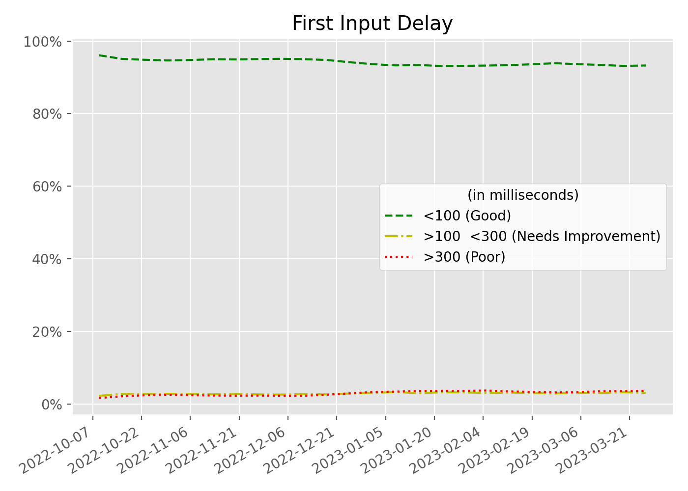

# First Input Delay (FID)

FID measures the time from when a user first interacts with a page (that is, when they click a link, tap on a button, or use a custom, JavaScript-powered control) to the time when the browser is actually able to begin processing event handlers in response to that interaction.

