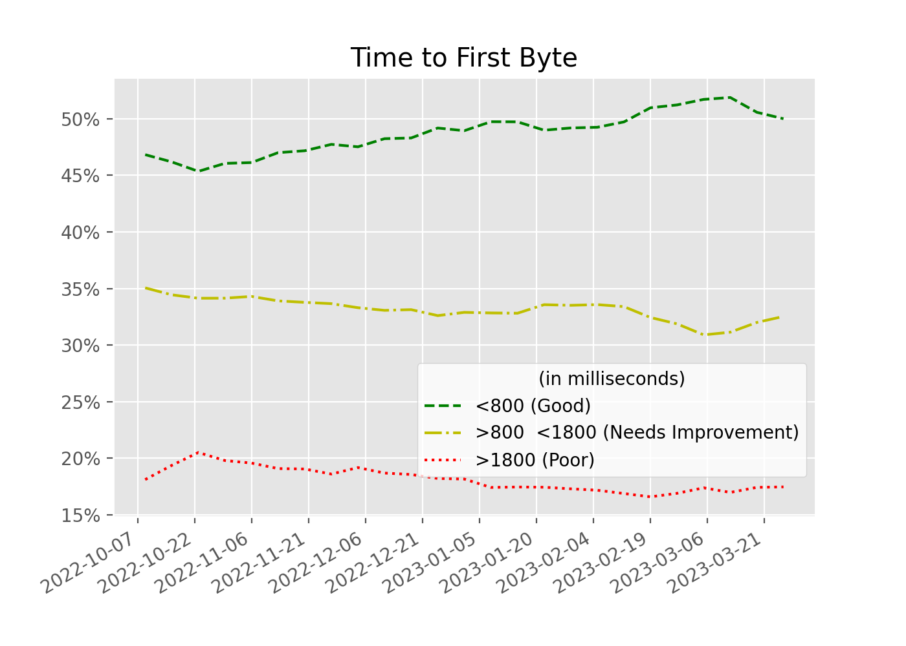

# Time to First Byte (TTFB)

TTFB is the sum of the following request phases:

* Redirect time
* Service worker startup time (if applicable)
* DNS lookup
* Connection and TLS negotiation
* Request, up until the point at which the first byte of the response has arrived

